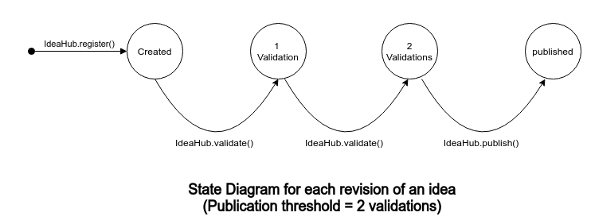

IdeaHub Smart Contract
===========================
**Main resources**
- [IdeaHub Platform Contract Interface](contracts/IIdeaHub.sol)
- [IdeaHub Contract Implementation](contracts/IdeaHub.sol)

### Test
`npm run truffle test`

### Operation of the Contract
IdeaHub Smart Contract has 4 entities
- **Foundation**, admin of contract 
- **Ideas**, any sort of research or creative work
- **Authors** register ideas in the contract
- **Validators** review and validate the ideas

#### Contract Deployment
IdeaHub Foundation deploys the contract and is the owner of IdeaHub Contract. 
There are few parameters that are to be set during and after the deployment
- **IdeaHub Token paremeters** `setTokenTransferParams()` includes the address of ERC20 Token that is transferred 
to authors/validators on idea publication and the address from which the transfer is to be made 
- **Validation threshold and token shares** `setPlatformParams()`, the no of validations required for idea to be published and the token values transferred to each entity during publication
- **Signing Parameters** `setSigningParams()`, the parameters necessary for signing function calls when users can't pay transaction fee themselves.
#### Validator Registration
Foundation can add validators to the contract using `registerValidator()` function  or give the right of adding validators to other ethereum addresses.
#### Author Registration
Author registration is open and anyone can register themselves as an author in the platform using `registerAuthor()` function
#### Idea Creation, Validation and Publication
Authors registered to the platform can register their ideas in the platform using `register()` function.
When Idea is first registered, it is created as the first revision. Author can then update idea with new
revisions using the `register()` function with same idea and different content.

Validators can review and then submit their response to registered ideas. The method and process of assigning validators is not part of the contract.
Once the review process is done, validators simply call `validate()` function to mark the idea as validated by them in the contract.

Once an idea reaches enough validation, idea is published and token is distributed to author, validators and OSO foundation
by calling `pubhish()` function. Anyone can call the `publish()` function. The only requirement is that the idea has received enough validations.

